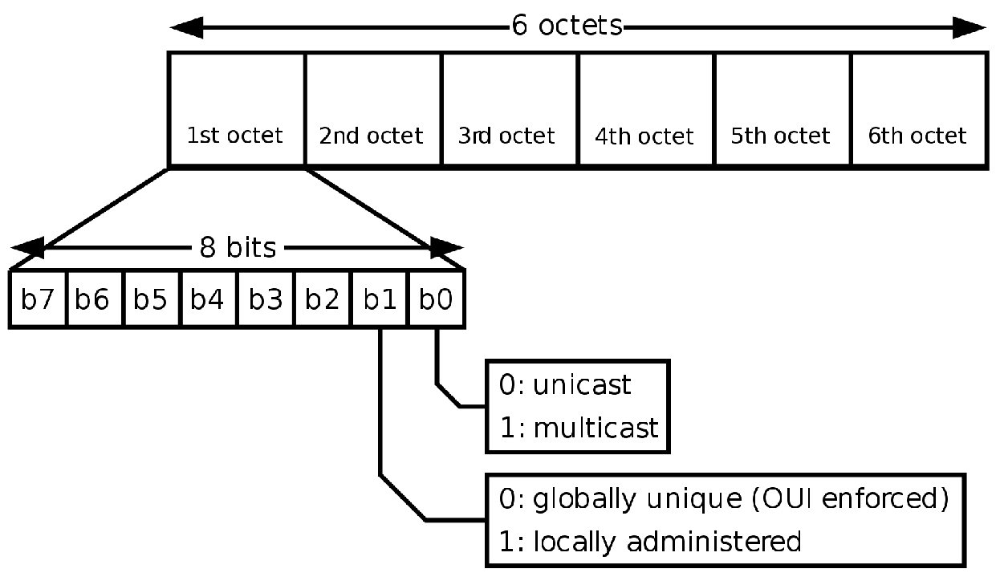
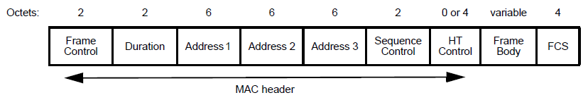
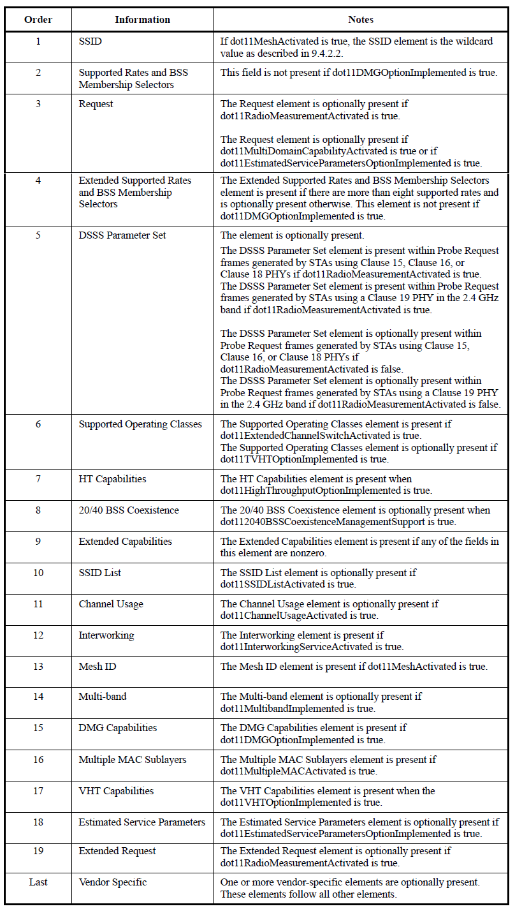
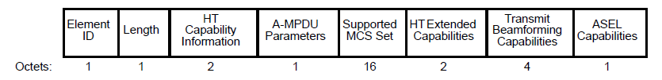

# Mac Address Randomization (K-NN) Defeating (MARKeD)

## Table of Contents

[//]: # (TOC Begin)

* [Context](#context)
* [Technical Background](#technical-background)
 
[//]: # (TOC End)

## Context

In order to find a suitable and active WiFi Access Point to connect to, 
WiFi-enabled devices need to implement a discovery protocol. The WiFi 
standards (IEEE 802.11) define two methods for a client device to discover
wireless networks: a *passive method* and an *active method* (with respect
to the client device).

In the first method, the *passive method*, infrastructure devices (i.e. 
Access Points) will send at regular intervals (approximately every 100 ms) 
*beacon frames* in order to advertise their presence. Client devices will
regularly scan for beacon frames, and in a completely anonymous way will
acquire knowledge about the WiFi-enabled environment they're in.  
The main drawback is that the client must listen on all channels for long
enough to be sure to don't miss the beacon; this can be very energy
consuming, the minimum waiting time is 200 ms, done for 11 channels
(up to 14 in some areas), means more than 2 seconds of high power usage 
mode on the receiver side.

This problem is in part solved by the *active method*, because in this case
is the client the one that sends out regularly packets, *probe requests*, in
order to advertise its presence. After sending out an "advert" it will listen
for a way shorter period of time for infrastructure devices' response (*probe
response*). 

However the second method, the *active method*, introduces an even bigger
problem: both methods use *layer 2 management frames* in order to advertise
their presence, but when is the client doing it, by regularly broadcasting its
MAC address exposes itself to being passively tracked and identified since the
MAC address is globally and uniquely associated to the network interface 
controller (NIC) and therefore to the device (along with the user behind it).

In order to prevent third parties from using the MAC address to track devices,
Android, Linux, iOS and Windows have implemented **MAC Address Randomization**.
This technique allows a device to send probes with a random MAC instead of the
real one and (by periodically changing it) to avoid being tracked or identified
during the network discovery process.

My goal is to overcome this technique by identifying the device not based on
its MAC address but on supplementary information included in probe requests,
using pattern recognition techniques.

## Technical Background

A **MAC address** is composed by 6 octets and is an unique identifier assigned
to a network interface controller (NIC). The first 3 octets compose the
organizationally unique identifier (OUI), a 24 bit number that uniquely
identifies a vendor, manufacturer or organization. The remaining 3 octets are
NIC-specific, and are assigned by the manufacturers of network interface cards.  
Random MAC addresses can be distinguished thanks to the second bit of the first
octet: 

- if set to **0** the mac is an Universally Administered Address - *UAA* (assigned by IEEE)
- if set to **1** the mac is a Locally Administered Address - *LAA* (random mac)

Some devices that implement the MAC Randomization technique change mac after
every network discovery attempt, other devices after a few attempts.

A **probe request** is a layer 2 management frame with two main purposes:

1. a client device advertises its presence and asks any infrastructure device
in range to do the same
2. in order to establish a connection between client and access point, both
advertise their technical capabilities and functionalities (e.g. supported data
rates)

The management frame format is:

and when it's a probe request, in the **Frame Body** we can find a list of
*elements* indicating device's capabilities. Each element is identified by a
**tag**, some elements are mandatory while others are optional but the order
specified in the standard is fixed. Following is the list of possible elements.

Each element is composed by a **tag** (Element ID), a length and a variable 
sized body. The body is often composed by bit fields indicating specific 
functionalities.  
For example, the High Throughput (HT) Capabilities element has this form:

and each field/bit is characteristic to the device.

When attempting network discovery, for each channel, devices send multiple
probe requests in a very short time interval. These are called **bursts**.

## Feature Selection

Among elements present in the body of a probe request frame, some are of
particular interest since they identify data and capabilities directly
connected to the device sending the probe. This manually selected set of
elements will be the *features* used in the pattern recognition algorithm.  
When put together they represent the **device fingerprint**.

What follows is a description of these features followed by a description of
the metrics used to compute the distance between the different types of
features.

### Element Presence

This is an *aggregated feature*, different devices send a different subset of
elements in the frame body. Only a finite number of standard elements are
considered (Vendor-specific elements are ignored) and for each device is stored
in a bit map an indication if the *i*-th element is present.

### Supported Rates Element

This element specifies the device's data transmission supported rates. These are
dependent on device hardware and are in finite number. As for the
[Element Presence](#element-presence) feature this element is coded into a
binary vector for each device.

### SSID Element

Some probe requests, called *directed probe request* contain the name of the
wireless networks they are looking for. This can be certainly used to
distinguish a device from another based on their known wireless networks.  
Being this a *nominal feature* in order to compute the distance between these
features the 

### Entropy

